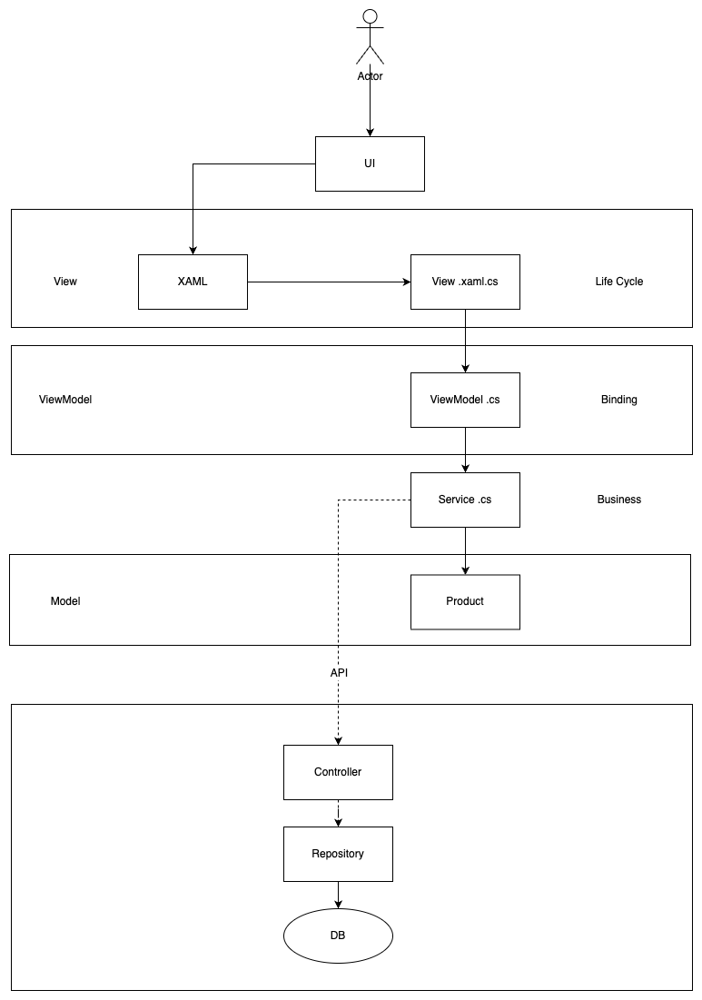
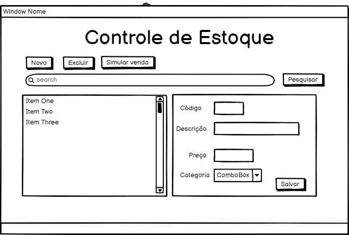

# Storage API

## Folders
estoque-api - API
estoque-api.Tests - Unittests
storage_app - Desktop APP
doc - Documentation

## To run:
```
dotnet clean
dotnet build
dotnet tool install --global dotnet-ef
dotnet ef database update
dotnet watch run
```

## Endpoints

| Path | Description |
| :--- | :--- |
| GET v1/products | get all products |
| GET v1/products/{id} | get product by id |
| POST v1/products | create product |
| PUT v1/products/{id} | update product by id|
| DELETE v1/products/{id} | delete product by id |
| GET v1/products/filters?descriprion={description}&category={category}&quantity={quant} | filter by one or all of the parameters (category, description and quantity (lte)) |
| POST v1/products/sell/{id}/{quantity} | sell product whith id and quantity (validation implemented)|
|                         |                      |
| GET v1/categories | get all categories |
| GET v1/categories/{id} | get category by id |
| PUT v1/categories/{id} | update category by id|
| DELETE v1/categories/{id} | delete category by id |
| POST v1/categories | create category |


## Status Codes

Storage API returns the following status codes in its API:

| Status Code | Description |
| :--- | :--- |
| 200 | `OK` |
| 201 | `CREATED` |
| 400 | `BAD REQUEST` |
| 404 | `NOT FOUND` |
| 500 | `INTERNAL SERVER ERROR` |

## Infrastructure



## Prototype

